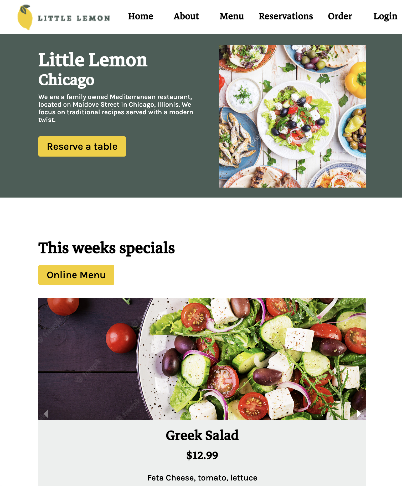
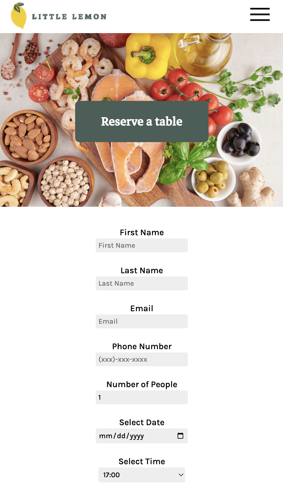

# Little Lemon Restaurant
This is the final capstone project for the Meta Front-end developer program on Coursera. It is a detailed and responsive website for the Little Lemon restaurant, with table-booking functionality built using React, Formik, and Yup. . The project utilizes HTML, CSS, JSX, and React, and integrates with third-party libraries such as react-router-dom and react-responsive-carousel.

## Screenshots

### Booking Page

### Technology Stack
The Little Lemon Restaurant website is built using HTML, CSS, JSX, and React.

### Third-Party Libraries & APIs
The following third-party libraries and APIs were used to build the website:

react-router-dom: for managing page routing
react-responsive-carousel: for displaying a responsive carousel of images on the Home Page
Formik: for building forms and handling form submissions in React
Yup: for form validation

### Installation and Usage
To install and run the project:

Download or clone the repository to your local machine.
Open a terminal window and navigate to the 'reserve-a-table' folder.
Run the command npm install to install the required dependencies.
Run the command npm start to start the server.
Open a web browser and go to http://localhost:3000 to view the website.
### Author
This project was created by Marco Raffaele.